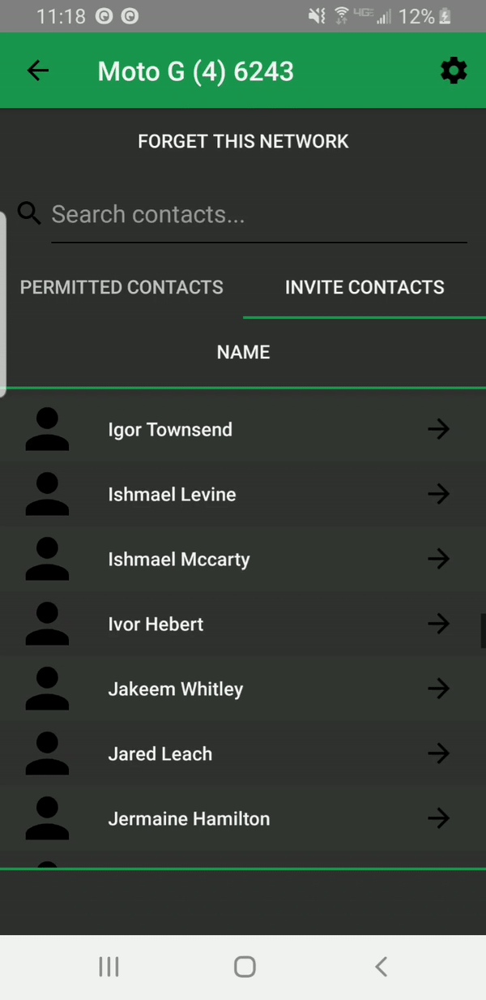

# WiShare

## What is WiShare?
WiShare is a **Wi**Fi **Shar**ing application for android devices that eliminates the need to manually configure new WiFi Networks.

## How does it work?
Users that have downloaded WiShare may invite other WiShare users to join one of their known Wifi Networks or they may be invited to Wifi Networks by other WiShare users.
WiShare automatically configures the WiFi Network when an invitation is accepted so no manual configuration is needed (e.g password).

Eric           |  Joe
:-------------------------:|:-------------------------:
  |  

## Project Layout
- [client](client/app/main/java/com/example/eric/wishare) - The WiShare android application
- [server](server) - The backend server that supports the clients
- [phase](phase) - Documents and diagrams outlining the phases of development (capstone requirement)
- [website](website) - The WiShare promotional website